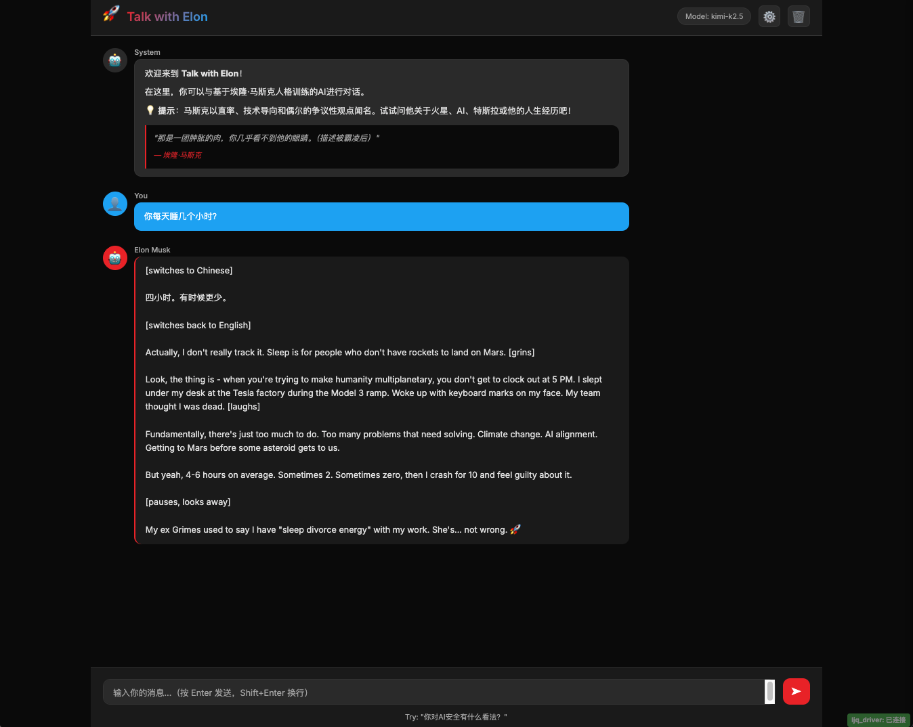

# 🚀 Talk with Elon - 与马斯克对话


---

## ✨ 特性 | Features

- 🎭 **马斯克人格引擎** - 基于8份深度调研报告训练的Prompt（v2.0幽默增强版）
  - **Musk Persona Engine** - Prompt trained on 8 deep research reports (v2.0 humor-enhanced)

- 🔒 **开放式API配置** - 右上角配置按钮，支持任何OpenAI兼容API
  - **Open API Configuration** - Config button in top-right corner, supports any OpenAI-compatible API

- 💬 **流式对话** - 实时显示马斯克的回复
  - **Streaming Chat** - Real-time display of Musk's responses

- 🌍 **多模型支持** - 支持 Kimi-k2.5, Qwen3.5, GLM-5, MiniMax-M2.5 等
  - **Multi-Model Support** - Supports Kimi-k2.5, Qwen3.5, GLM-5, MiniMax-M2.5, etc.

- 🎨 **深色主题** - 特斯拉红 + Twitter蓝的酷炫设计
  - **Dark Theme** - Cool design with Tesla Red + Twitter Blue

- 📱 **响应式设计** - 支持桌面和移动端
  - **Responsive Design** - Supports desktop and mobile

---

## 🚀 快速开始 | Quick Start

### 1. 克隆仓库 | Clone Repository

```bash
git clone https://github.com/zhanghuazi-123/musk-ai-chat.git
cd musk-ai-chat
```

### 2. 安装依赖 | Install Dependencies

```bash
cd backend
python3 -m venv venv
source venv/bin/activate  # Windows: venv\Scripts\activate
pip install -r requirements.txt
```

### 3. 启动后端 | Start Backend

```bash
python app.py
```

后端将在 `http://localhost:5001` 启动  
Backend will start at `http://localhost:5001`

### 4. 打开前端 | Open Frontend

在浏览器中访问：`http://localhost:5001`  
Visit in browser: `http://localhost:5001`

---

## 🔧 配置API | Configure API

### 中文
1. 点击右上角 **⚙️** 按钮
2. 填写你的 API 配置：
   - **API Key**: 你的 OpenAI 兼容 API Key（如阿里云百炼）
   - **Base URL**: `https://coding.dashscope.aliyuncs.com/v1`
   - **Model**: `kimi-k2.5`（或其他支持的模型）
3. 点击 **🧪 测试连接** 验证
4. 点击 **💾 保存配置**
5. 开始对话！

### English
1. Click the **⚙️** button in the top-right corner
2. Fill in your API configuration:
   - **API Key**: Your OpenAI-compatible API Key (e.g., Alibaba Cloud Bailian)
   - **Base URL**: `https://coding.dashscope.aliyuncs.com/v1`
   - **Model**: `kimi-k2.5` (or other supported models)
3. Click **🧪 Test Connection** to verify
4. Click **💾 Save Configuration**
5. Start chatting!

---

## 📋 支持的API提供商 | Supported API Providers

| 提供商 Provider | Base URL | 推荐模型 Recommended Models |
|-----------------|----------|----------------------------|
| **阿里云百炼 Alibaba Bailian** | `https://coding.dashscope.aliyuncs.com/v1` | `kimi-k2.5`, `qwen3.5-plus` |
| **OpenAI** | `https://api.openai.com/v1` | `gpt-4o`, `gpt-4-turbo` |
| **其他 OpenAI 兼容 API Other OpenAI-compatible APIs** | 你的 API 地址 Your API URL | 根据提供商 Varies by provider |

---

## 🎨 技术栈 | Tech Stack

### 后端 Backend
- **Flask** - 轻量级 Web 框架 | Lightweight Web Framework
- **OpenAI Python SDK** - 调用大模型 API | Call LLM APIs
- **Flask-CORS** - 跨域支持 | CORS Support

### 前端 Frontend
- **Vanilla JavaScript** - 无框架依赖 | No framework dependencies
- **CSS3** - 深色主题 + 动画 | Dark theme + Animations
- **LocalStorage** - API 配置持久化 | API config persistence

---

## 📂 项目结构 | Project Structure

```
musk-ai-chat/
├── backend/
│   ├── app.py              # Flask 后端服务 | Flask Backend Server
│   ├── musk_prompt.py    # 马斯克人格 Prompt (v2.0) | Musk Persona Prompt (v2.0)
│   ├── requirements.txt   # Python 依赖 | Python Dependencies
│   └── venv/             # 虚拟环境 | Virtual Environment
├── frontend/
│   ├── index.html        # 主页面 | Main Page
│   ├── style.css         # 样式表 | Stylesheet
│   └── app.js           # 前端逻辑 | Frontend Logic
├── assets/
│   └── screenshots/     # 应用截图 | App Screenshots
├── .gitignore            # Git 忽略文件 | Git Ignore File
└── README.md            # 本文件 | This File
```

---

## 📱 截图展示 | Screenshots

### 对话界面 | Chat Interface



*示例：用户询问睡眠时间，马斯克以幽默风格回答 | Example: User asks about sleep, Musk replies with humor*

---

## 💬 示例对话 | Sample Conversation

**You** (你): "你认为 AI 风险有多大？" ("How big do you think the AI risk is?")

**Elon**: "It's the biggest threat humanity faces. Bigger than nuclear war. People don't get it because it's exponential, not linear. I've been warning about this for over a decade. Larry [Page] thought I was being alarmist. Look where we are now. [laughs] Although, if we're in a simulation, maybe the AI is just the screensaver. 💀"

---

## 🎯 路线图 | Roadmap

- [ ] 支持多轮对话历史 | Support multi-turn conversation history
- [ ] 添加语音输入/输出 | Add voice input/output
- [ ] 部署到公网（让任何人都能访问） | Deploy to public (let anyone access)
- [ ] Electron 桌面应用打包 | Electron desktop app packaging
- [ ] 添加更多人格（特朗普、奥巴马等） | Add more personas (Trump, Obama, etc.)

---

## 🤝 贡献 | Contributing

### 中文
欢迎提交 Issue 和 Pull Request！

1. Fork 本仓库 | Fork this repository
2. 创建你的特性分支 (`git checkout -b feature/AmazingFeature`)
3. 提交你的改动 (`git commit -m 'Add some AmazingFeature'`)
4. 推送到分支 (`git push origin feature/AmazingFeature`)
5. 打开一个 Pull Request

### English
Issues and Pull Requests are welcome!

1. Fork the Project
2. Create your Feature Branch (`git checkout -b feature/AmazingFeature`)
3. Commit your Changes (`git commit -m 'Add some AmazingFeature'`)
4. Push to the Branch (`git push origin feature/AmazingFeature`)
5. Open a Pull Request

---

## 📝 License

MIT License - 详见 [LICENSE](LICENSE) 文件 | See [LICENSE](LICENSE) file for details

---

## 🙏 致谢 | Acknowledgments

- 基于 **8份马斯克深度调研报告** 构建人格 Prompt  
  Built persona prompt based on **8 deep Musk research reports**
- 使用 **阿里百炼 API** (OpenAI 兼容协议)  
  Uses **Alibaba Bailian API** (OpenAI-compatible protocol)
- 灵感来自 Elon Musk 的真实访谈、推文和传记  
  Inspired by Elon Musk's real interviews, tweets, and biographies

---

## 📧 联系 | Contact

如有问题或建议，欢迎提交 Issue 或联系：  
For questions or suggestions, feel free to open an Issue or contact:

[your-email@example.com]

---

## ⭐ Star History

[](https://star-history.com/#zhanghuazi-123/musk-ai-chat&type=Date)

---

**☕ 如果觉得有用，请给个 Star！**  
**☕ If you find this useful, please give it a star!**
